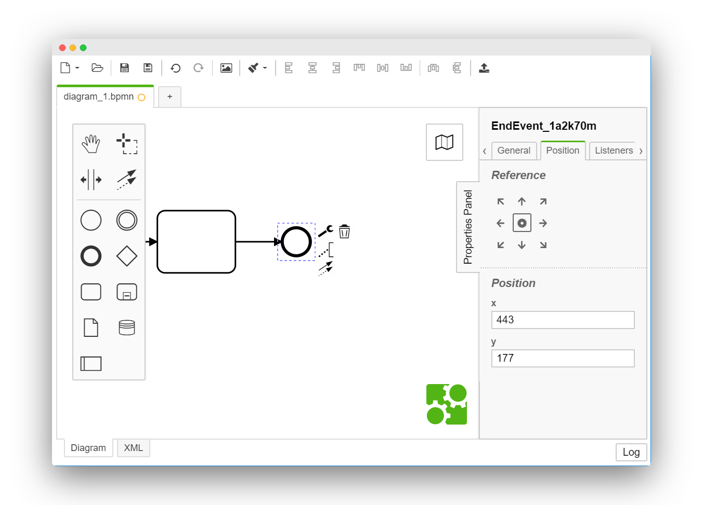

# Camunda Modeler Set Position Plugin

[](https://github.com/camunda/camunda-modeler)



This [Camunda Modeler Plugin](https://github.com/camunda/camunda-modeler) lets you set an element's position through the properties panel.

> :warning: This plugin disables the [align-to-origin feature](https://github.com/bpmn-io/align-to-origin) since it would change element positions whenever you save.

## Building

Install dependencies:

```sh
npm install
```

Package plugin to `client/client-bundle.js`:

```sh
npm run bundle

# or

npm run bundle:watch
```

## Additional Resources

* [Plugins documentation](https://github.com/camunda/camunda-modeler/tree/master/docs/plugins)

## Licence

MIT
